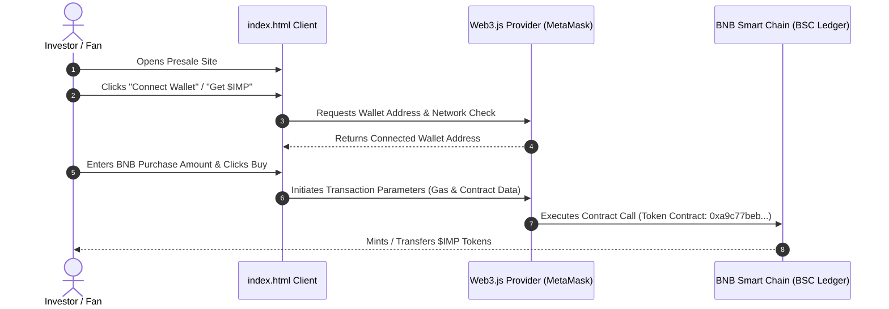

# 🚀 IMP Impulseops - Token Pre-sale & NFT Airdrop Portal

A Web3-enabled landing portal and pre-sale client for the `$IMP` (Impulseops) token and NFT collection on the BNB Smart Chain (BSC). This frontend integrates Web3.js to enable MetaMask wallet connection, token purchase transactions, and airdrop claims.

[](https://developer.mozilla.org/en-US/docs/Glossary/HTML5)
[](https://developer.mozilla.org/en-US/docs/Web/CSS)
[](https://developer.mozilla.org/en-US/docs/Web/JavaScript)
[](https://web3js.org/)
[](https://www.bnbchain.org/)

---

## 📋 Project Description

The IMP Impulseops platform serves as the primary entry point for the IMP NFT ecosystem. The application is built as a highly responsive, animated landing page featuring neon-cyberpunk visual themes. It links fans and investors directly to the BNB Smart Chain ledger, allowing them to connect their non-custodial crypto wallets (e.g. MetaMask, Trust Wallet) and purchase or claim `$IMP` utility and governance tokens.

---

## 🏗️ Web3 Wallet & Presale Transaction Flow

The sequence diagram below displays the user interaction, wallet connection, and token claim flow:



---

## 📁 Repository Directory Structure

```text
impulseops/
├── css/
│   └── style.css          # Styling rules for neon components, grids, and animations
├── fonts/                 # Local assets (logos, custom fonts, icons)
├── js/
│   ├── app.js             # Core client logic (web3 wallet connection, transactions, claims)
│   ├── timer.js           # Countdown timer script for presale launch
│   ├── web3.js            # Web3.js client-side provider library
│   └── main.min.js        # Minified layout interaction helpers (menus, modals)
├── index.html             # Main landing portal and token interaction dashboard
├── jquery.min.html        # Embedded helper elements
└── README.md              # Root documentation file (this file)
```

---

## ⚙️ How to Deploy & Run Locally

### Prerequisites
*   A modern web browser (Google Chrome, Brave, Edge).
*   A Web3 wallet browser extension (e.g. [MetaMask](https://metamask.io/)).
*   A local web server (e.g. Live Server extension in VS Code, or python `http.server`).

### 1. Clone the Repository
```bash
git clone https://github.com/BGJ06/impulseops.git
cd impulseops
```

### 2. Launch Local Server
To ensure Web3.js provider requests are handled correctly, serve the files via a local server rather than opening `index.html` directly:
```bash
# Python 3
python -m http.server 8000

# Node.js (if http-server is installed globally)
npx http-server -p 8000
```
Open **`http://localhost:8000`** in your browser.

### 3. Smart Contract Verification
The token is deployed on the BNB Smart Chain (BSC) under the contract address:
**`0xa9c77beb023bf44de5131a1fa576ca25569c151d`**

You can inspect the verified smart contract and transactions on **[BscScan](https://bscscan.com/token/0xa9c77beb023bf44de5131a1fa576ca25569c151d)**.

---

## 🎨 Design and UI Features
*   **Futuristic Neon Aesthetics**: Built with high-contrast text glow keyframes, grid spacing, and transparent container backdrops.
*   **Countdown Timers**: Built-in timer modules (`js/timer.js`) displaying live updates for registration and presale phases.
*   **Web3 Controls**: Interactive wallet connection buttons that display connected addresses or prompt wallet connection on click.

---

## 👨‍💻 Developer Credit
This platform was developed and is maintained by:
*   **Mithun Raj T** ([@BGJ06](https://github.com/BGJ06))

---

## 📝 License & Disclaimer
This project is open-source and is licensed under the MIT License. This software is provided as a prototype; verify contract addresses on-chain before initiating transfers.